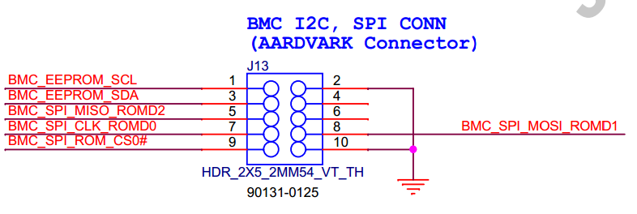
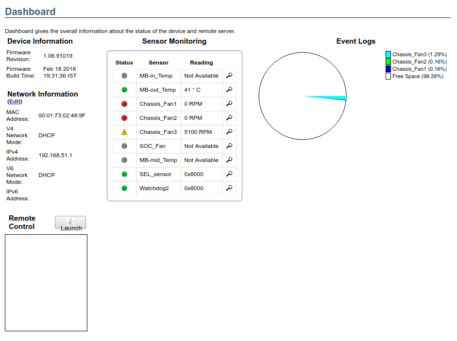

### 1. SPI flash 방법

SF100을 이용하여 연결 

### 2. ast-2400 bmc web 연결



### 3. openbmc - barreleye

```bash
$ git clone https://github.com/openbmc/openbmc-build-scripts.git
$ cd openbmc-build-scripts
$ ./build-setup.sh 타겟이름
```

```bash
$ dbus-send --system --dest=org.freedesktop.DBus --type=method_call --print-reply /org/freedesktop/DBus org.freedesktop.DBus.ListNames

array[] string "org.freedesktop.DBus" string "xyz.openbmc_project.State.Host" string ":1.7" string "xyz.openbmc_project.LED.Controller.identify" string ":1.8" string ":1.9" string "org.openbmc.control.Host" string "xyz.openbmc_project.Logging" string"org.freedesktop.systemd1" string "xyz.openbmc_project.Software.BMC.Updater" string "xyz.openbmc_project.LED.Controller.heartbeat" string "org.openbmc.NetworkManager" string "org.openbmc.control.Power" string "org.freedesktop.network1" string "xyz.openbmc_project.LED.GroupManager" string "org.openbmc.managers.System" string "xyz.openbmc_project.State.Chassis" string "xyz.openbmc_project.Dump.Manager" string ":1.80" string "org.openbmc.Sensors" string ":1.60" string "xyz.openbmc_project.LED.Controller.power" string ":1.61" string "xyz.openbmc_project.Network" string ":1.40" string ":1.63" string ":1.64" string ":1.20" string ":1.65" string ":1.21" string ":1.44" string ":1.22" string "org.openbmc.buttons.reset" string ":1.45" string ":1.23" string ":1.46" string ":1.25" string "xyz.openbmc_project.ObjectMapper" string ":1.26" string "org.openbmc.control.Fans" string ":1.27" string ":1.29" string "xyz.openbmc_project.Settings" string "xyz.openbmc_project.State.BMC" string "xyz.openbmc_project.Inventory.Manager" string ":1.118" string ":1.119" string "xyz.openbmc_project.LED.Controller.beep" string "org.freedesktop.Avahi" string "org.openbmc.managers.Download" string "org.openbmc.settings.Host" string "org.openbmc.control.Chassis" string "xyz.openbmc_project.Software.Version" string "org.openbmc.buttons.Power" string "org.openbmc.Inventory" string "org.openbmc.control.BmcFlash" string ":1.51" string ":1.74" string "xyz.openbmc_project.Control.Host" string "xyz.openbmc_project.Software.Download" string ":1.75" string ":1.53" string "org.openbmc.control.Flash" string "org.openbmc.HostIpmi" string "org.openbmc.TimeManager" string ":1.10" string "org.open_power.Software.Host.Updater" string ":1.11" string ":1.56" string "org.openbmc.UserManager" string ":1.12" string ":1.57" string ":1.0" string ":1.13" string ":1.58" string ":1.1" string ":1.14" string ":1.59" string ":1.2" string ":1.15" string ":1.3" string ":1.16" string ":1.4" string ":1.17" string "org.openbmc.control.Bmc" string ":1.5" string ":1.18" string ":1.6" string ":1.19" ]
```
